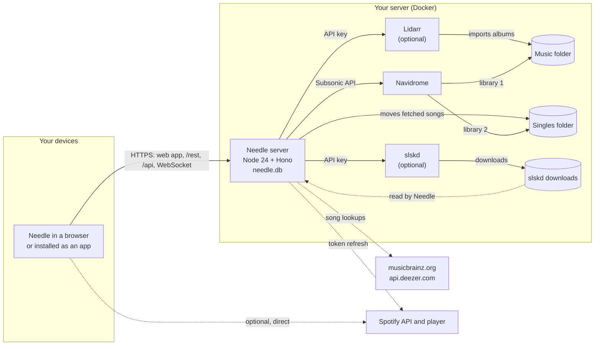
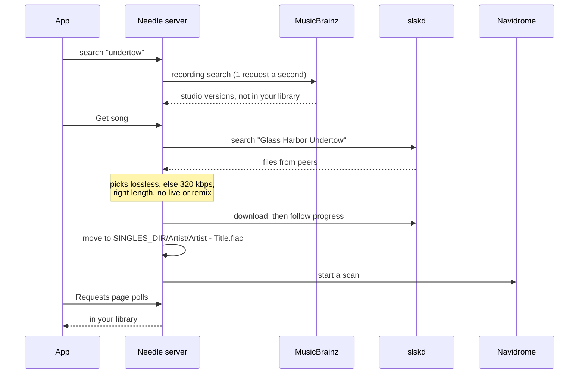

<p align="center">
  
</p>

# Needle

A music player for your [Navidrome](https://www.navidrome.org) library. It runs in
any browser, installs on a phone's home screen, and can fetch the albums and songs
you don't have yet through Lidarr and Soulseek. Everything runs on your own server.

<table>
  <tr>
    <td width="50%"></td>
    <td width="50%"></td>
  </tr>
  <tr>
    <td width="50%"></td>
    <td width="50%">
      
      
    </td>
  </tr>
</table>

## Contents

- [What it does](#what-it-does)
- [How it fits together](#how-it-fits-together)
- [Quick start](#quick-start)
- [HTTPS](#https)
- [Fetching albums with Lidarr](#fetching-albums-with-lidarr)
- [Fetching single songs with slskd](#fetching-single-songs-with-slskd)
- [Spotify](#spotify)
- [Users and permissions](#users-and-permissions)
- [Configuration reference](#configuration-reference)
- [Data, backups and updates](#data-backups-and-updates)
- [Security](#security)
- [Troubleshooting](#troubleshooting)
- [Development](#development)
- [License and credits](#license-and-credits)

## What it does

- **Listen:** albums, artists, playlists, liked songs, genres, decades, and six mixes
  built each morning from your library. A queue with "play next", shuffle that keeps
  what you queued, repeat one or all, and similar songs when the queue ends.
- **Sound:** crossfade (desktop browsers), gapless playback, volume levelled from
  ReplayGain, and original files or Opus/AAC on mobile data.
- **Lyrics** that follow the song and seek when you tap a line.
- **Your listening:** hours, top artists and albums, genres and time of day, for any
  period, from Needle's own play log.
- **Search** matches text anywhere in titles, artists and albums, with list and grid
  views and sorting everywhere.
- **Fetch music** (optional): search also lists albums and songs you don't have.
  **Get album** asks Lidarr; **Get song** fetches one song from Soulseek through slskd.
  The Requests page follows both until they're in your library.
- **Devices:** every open Needle signed in as you is listed. Pause or skip on another
  device, send your queue there, or pick up at the same second somewhere else.
- **Offline:** download albums, playlists or liked songs to the device. They're kept
  in the browser on that device.
- **Spotify** (optional): your Spotify library, search and playback next to your own
  music, with an on/off switch per account.
- Internet radio, keyboard shortcuts (`?` lists them), lock-screen controls, an
  account photo, and a Connections page that checks your setup.

Needle has no accounts of its own: you sign in with your Navidrome account.

## How it fits together



- The browser talks only to the Needle server (plus Spotify, when it's on). `/rest/*`
  is Navidrome's Subsonic API passed through, so Navidrome never needs its own
  public address. `/api/*` is Needle's own API, signed with the same Navidrome token.
  `/api/devices` is a WebSocket for the device list.
- Lidarr's and slskd's API keys and Spotify's client secret stay on the server.
- `needle.db` (SQLite) keeps play history, requests, account photos and Spotify
  sign-ins. Your music, playlists and likes stay in Navidrome.

Fetching a single song, end to end:



[docs/architecture.md](docs/architecture.md) goes deeper: the code layout, caching,
search, Spotify's rate limits and offline downloads.

## Quick start

You need Docker with Compose, and a folder of music. Needle's image is built from
this repository and runs the same on x86-64 (amd64) and ARM64 (Raspberry Pi 4/5,
Apple silicon): its base image is multi-arch and it has no native modules.

```bash
git clone https://github.com/bugrauluyurt/needle.git
cd needle/examples
cp .env.example .env            # set MUSIC_DIR, PUID/PGID (id -u, id -g) and TZ
mkdir -p config/navidrome config/needle
docker compose up -d --build
```

This starts Navidrome on port 4533 and Needle on port 4535
([examples/compose.yml](examples/compose.yml)).

1. Open `http://<server>:4533` and create Navidrome's first user. It becomes an admin.
2. Open `http://<server>:4535` and sign in with that user.

Plain HTTP works for trying it out on your own network. Offline downloads, Spotify
and installing the app need HTTPS; see the next section.

Already running Navidrome? Add only the `needle` service to your compose file and
point `NAVIDROME_URL` at Navidrome as the Needle container reaches it (for example
`http://navidrome:4533` on the same Docker network).

To build without cloning, use the repository as the build context:
`build: https://github.com/bugrauluyurt/needle.git`. To publish your own image for
both architectures:

```bash
docker buildx build --platform linux/amd64,linux/arm64 -t <registry>/needle:latest --push .
```

## HTTPS

Browsers only allow service workers (offline downloads, installing the app) and
Spotify's sign-in on secure pages. Put Needle behind something that gives it an
`https://` address, then set `PUBLIC_URL` to that address. Any reverse proxy works as
long as it passes WebSockets through (Needle's device list uses `/api/devices`).

### Tailscale Serve (private, no domain needed)

If your devices are on a [Tailscale](https://tailscale.com) tailnet, Tailscale
issues a real certificate for the server's `*.ts.net` name and nothing is exposed
to the internet. Turn on HTTPS certificates in the Tailscale admin console (DNS
page), then on the server:

```bash
sudo tailscale serve --bg --https=443 http://127.0.0.1:4535
```

Needle is then at `https://<machine>.<tailnet>.ts.net`, and
`PUBLIC_URL=https://<machine>.<tailnet>.ts.net`. Use another port, such as
`--https=4535`, to keep 443 free for something else; the address then ends in `:4535`.
`tailscale serve status` shows what's served, and the setting survives restarts.

### Caddy (a domain you own)

[Caddy](https://caddyserver.com) gets and renews a Let's Encrypt certificate by
itself. Point your domain's DNS at the server, open ports 80 and 443, set
`NEEDLE_DOMAIN` and `PUBLIC_URL` in `.env`, and add Caddy to the stack:

```bash
docker compose -f compose.yml -f compose.caddy.yml up -d
```

[examples/Caddyfile](examples/Caddyfile) is all it needs; Caddy passes WebSockets
through on its own. With a domain that only resolves inside your network, use
Caddy's DNS challenge instead (see Caddy's docs), because Let's Encrypt can't reach
the server to check it.

### Other proxies

nginx, Traefik and the rest work the same way: proxy everything to `needle:4535` and
allow the WebSocket upgrade on `/api/devices`. For nginx that means
`proxy_http_version 1.1`, `proxy_set_header Upgrade $http_upgrade` and
`proxy_set_header Connection "upgrade"`.

## Fetching albums with Lidarr

[Lidarr](https://lidarr.audio) fetches whole albums and imports them into your music
folder. Needle only asks it for albums; set Lidarr up with at least one indexer or
download client first (the
[Tubifarry](https://github.com/TypNull/Tubifarry) plugin lets Lidarr use slskd).

1. Run Lidarr with the same music folder Navidrome reads, mounted read-write.
   [examples/compose.fetching.yml](examples/compose.fetching.yml) has a working
   service.
2. In Lidarr, add that folder as a root folder (Settings → Media Management).
3. Copy Lidarr's API key (Settings → General) into `LIDARR_API_KEY`, and set
   `LIDARR_URL` (`http://lidarr:8686` on the same Docker network).
4. Optional: `LIDARR_QUALITY_PROFILE` (a profile's name) and `LIDARR_ROOT_FOLDER`
   (a root folder's path). Without them Needle uses the root folder's defaults.

In Needle, search for an album you don't have and tap **Get album**. Needle adds the
artist to Lidarr unmonitored and monitors only that album, so Lidarr doesn't start
downloading the artist's whole discography. The Requests page shows Lidarr's queue.

## Fetching single songs with slskd

Lidarr only fetches whole albums. For single songs Needle uses
[slskd](https://github.com/slskd/slskd), a Soulseek client, and keeps the songs in a
separate folder that Navidrome reads as a second library:

```
 slskd downloads ──► $SOULSEEK_DIR/downloads/<folder>/<file>
                          │  Needle reads it (mounted at /soulseek)
                          ▼
 Needle moves it ──► $SINGLES_DIR/<Artist>/<Artist> - <Title>.<ext>   (mounted at /singles)
                          │  Navidrome's second library, read-only
                          ▼
 Navidrome scan ──► the song is in your library
```

1. Run slskd with a Soulseek account (`SOULSEEK_USER`, `SOULSEEK_PASS`) and an API
   key (`SLSKD_API_KEY`, any long random string such as `openssl rand -hex 32`).
2. Mount slskd's downloads folder into Needle at `/soulseek` (read-write, because
   Needle moves files out of it), and a new, empty folder at `/singles`. Keep it
   separate from Lidarr's music folder so Lidarr never touches these songs.
3. Mount the same singles folder into Navidrome, read-only, at `/singles`.
4. In Navidrome (0.58 or later), add a library: **Settings → Libraries → New**,
   path `/singles`. Then give your users access to it: **Settings → Users**, open each
   user, tick the library. Admins see every library.
5. Set `SLSKD_URL` (`http://slskd:5030`) and `SLSKD_API_KEY` for Needle.

```bash
mkdir -p config/lidarr config/slskd "$SINGLES_DIR" "$SOULSEEK_DIR"/{downloads,incomplete}
docker compose -f compose.yml -f compose.fetching.yml up -d --build
```

Needle picks the best copy it finds: lossless first, otherwise 320 kbps or better,
the right length, and no live, remix or cover versions. If a peer fails it tries the
next one, up to three. MusicBrainz is asked at most once a second, as it requires.

**File ownership:** the Needle image runs as uid 1000. If your media belongs to
another user, set `user: "<uid>:<gid>"` on the `needle` service (the examples use
`PUID` and `PGID`) so it can move files into the singles folder.

## Spotify

Optional. It adds your Spotify library, search and playback beside your own music.
Playback uses Spotify's Web Playback SDK, which needs Premium and a desktop or
Android browser; on iPhone, Spotify songs can be browsed but not played. The server
never downloads anything from Spotify.

1. Create an app in the [Spotify developer dashboard](https://developer.spotify.com/dashboard)
   with the **Web API** and **Web Playback SDK**.
2. Add the redirect URI `<PUBLIC_URL>/api/spotify/callback`. It must be `https://`.
   Settings → Connections shows the exact value.
3. Under **User Management**, add the Spotify account of everyone who'll connect.
   Apps in development mode only work for listed users, and Spotify limits them.
4. Set `SPOTIFY_CLIENT_ID`, `SPOTIFY_CLIENT_SECRET` and `PUBLIC_URL`, restart
   Needle, then choose **Settings → Connect Spotify** in Needle.

Spotify rate-limits development-mode apps. When it refuses (`429`), Needle stops
calling it for as long as Spotify asks and hides Spotify meanwhile. Each device
caches your Spotify library for six hours. **Settings → Use Spotify in Needle**
turns it off for your account on every device.

## Users and permissions

Every Navidrome user can sign in.

| Separate for each user | Shared by everyone |
|---|---|
| Liked songs, albums and artists; ratings | The music itself (users can be limited to some Navidrome libraries) |
| Playlists (private unless made public) | Internet radio stations |
| Play counts, Your listening, daily mixes | |
| The queue, and picking up on another device | |
| Spotify connection and its on/off switch; account photo | |

Only Navidrome **admins** can ask for albums and songs, see Lidarr's queue, add
radio stations and open Settings → Connections. Add users in Navidrome
(**Settings → Users**).

## Configuration reference

All settings are environment variables on the `needle` container. Empty values count
as unset.

| Variable | Default | |
|---|---|---|
| `NAVIDROME_URL` | `http://127.0.0.1:4533` | Navidrome as the Needle server reaches it |
| `PUBLIC_URL` | | The `https://` address people open. Needed for Spotify |
| `PORT` | `4535` | Port the server listens on |
| `DATA_DIR` | `/data` in the image | Where `needle.db` lives |
| `TZ` | `UTC` | Time zone for daily mixes and listening stats |
| `LIDARR_URL`, `LIDARR_API_KEY` | | Turns on Get album |
| `LIDARR_QUALITY_PROFILE` | root folder's default | Quality profile name for new albums |
| `LIDARR_ROOT_FOLDER` | Lidarr's first root folder | Root folder path for new albums |
| `SLSKD_URL`, `SLSKD_API_KEY` | | Turns on Get song |
| `SOULSEEK_DIR` | `/soulseek` | slskd's downloads folder inside the Needle container |
| `SINGLES_DIR` | `/singles` | Where fetched songs go; a Navidrome library |
| `SPOTIFY_CLIENT_ID`, `SPOTIFY_CLIENT_SECRET` | | Turns on Spotify (with `PUBLIC_URL`) |
| `MUSICBRAINZ_URL` | `https://musicbrainz.org/ws/2` | Song lookups; the tests point it at a mock |
| `DEEZER_URL` | `https://api.deezer.com` | Popular songs for an artist |

**Transcoding:** Navidrome converts songs for the Opus/AAC quality settings. Its
Docker image includes ffmpeg and ready-made Opus and AAC transcodings, so there's
nothing to set up. Choose qualities in Needle's Settings.

## Data, backups and updates

- Back up `DATA_DIR` (`needle.db` holds plays, requests, photos and Spotify
  sign-ins) along with Navidrome's data folder. Your music, playlists and likes live
  in Navidrome.
- Offline downloads live in each browser and are never on the server.
- **Releases** are tagged `vX.Y.Z` and described in [CHANGELOG.md](CHANGELOG.md) and on
  the [Releases](https://github.com/bugrauluyurt/needle/releases) page. A major version
  means your setup needs a change; the changelog says what.
- **To update** a clone: `git fetch --tags && git checkout v1.2.0` (or `git pull` to
  follow `main`), then `docker compose up -d --build needle`. Building without a clone,
  point the build at a tag: `build: https://github.com/bugrauluyurt/needle.git#v1.2.0`.
- The database migrates itself on start. Open apps show **Update Needle** in the
  account menu; the new version loads when you choose it, so music isn't cut off.
  Settings → This app shows which version you're running.

## Security

- Needle checks every request against Navidrome, so it's only as open as your
  Navidrome accounts. Use strong passwords.
- Don't expose Needle to the internet without HTTPS. A private network such as
  Tailscale is the simplest safe setup.
- API keys and the Spotify client secret never reach the browser.
- Needle's server fetches only from Navidrome, Lidarr, slskd, MusicBrainz, Deezer,
  Spotify's accounts service, and the internet radio stations you add.

## Troubleshooting

Open **Settings → Connections** as an admin first. It checks each part and says how
to fix what's wrong:

| Check | Looks at |
|---|---|
| Secure address | Whether this page is on HTTPS |
| Public address | Whether `PUBLIC_URL` matches the address you opened |
| Navidrome | Reachable, its version and libraries |
| Lidarr | Reachable, its root folder and quality profile |
| slskd | Reachable and signed in to Soulseek |
| Song folders | slskd's downloads readable, the singles folder writable |
| Singles in Navidrome | Navidrome lists the songs Needle fetched |
| Song lookups | MusicBrainz and Deezer answer |
| Spotify | Keys set, and the redirect URI to register |

Common problems:

- **Sign-in says it can't reach Navidrome:** `NAVIDROME_URL` is the address from
  inside the Needle container. `localhost` there is the container itself; use the
  service name on a shared Docker network.
- **Fetched songs never appear:** the singles library is missing in Navidrome, or
  your user can't see it (step 4 of [slskd](#fetching-single-songs-with-slskd)).
- **Get song fails at "moving":** Needle can't write to `SINGLES_DIR` or delete from
  slskd's downloads. Check file ownership and the `user:` setting.
- **No Download button, or the app won't install:** the page isn't on HTTPS.
- **Spotify sign-in fails:** the redirect URI in Spotify's dashboard must match
  `<PUBLIC_URL>/api/spotify/callback` exactly, and your Spotify account must be listed
  under User Management.
- `docker logs needle` shows the server's errors.

## Development

Needle is a pnpm monorepo: `apps/web` (React 19, Vite, TanStack Query, plain CSS),
`apps/server` (Node 24 and Hono, running TypeScript directly with no build step) and
`packages/shared` (types and text matching).

```bash
pnpm install
pnpm fixtures              # generates e2e/.library: 38 tagged songs with covers and lyrics
pnpm navidrome:test        # a throwaway Navidrome on 127.0.0.1:14533 (admin / needle-test)
NEEDLE_DATA_DIR=./data pnpm seed   # playlists, likes, radio stations, 75 days of plays
cp .env.example .env
pnpm dev                   # server on :14535 and Vite on :5173
```

```bash
pnpm lint && pnpm typecheck
pnpm test                  # unit tests (Vitest)
pnpm --filter @needle/web build && pnpm e2e   # end-to-end, desktop and phone sizes
```

`pnpm e2e` starts what it needs: the test Navidrome, a mock Lidarr, a mock
slskd/MusicBrainz and a Needle server on the production build. Contributor
conventions are in [AGENTS.md](AGENTS.md).

## License and credits

[MIT](LICENSE). Needle builds on [Navidrome](https://www.navidrome.org) and talks to
[Lidarr](https://lidarr.audio), [slskd](https://github.com/slskd/slskd),
[MusicBrainz](https://musicbrainz.org), [Deezer](https://developers.deezer.com) and
[Spotify](https://developer.spotify.com). Artist biographies come from Last.fm
through Navidrome. The bundled fonts, Bricolage Grotesque and Instrument Sans, are
under the [SIL Open Font License](apps/web/public/fonts/OFL.txt).
