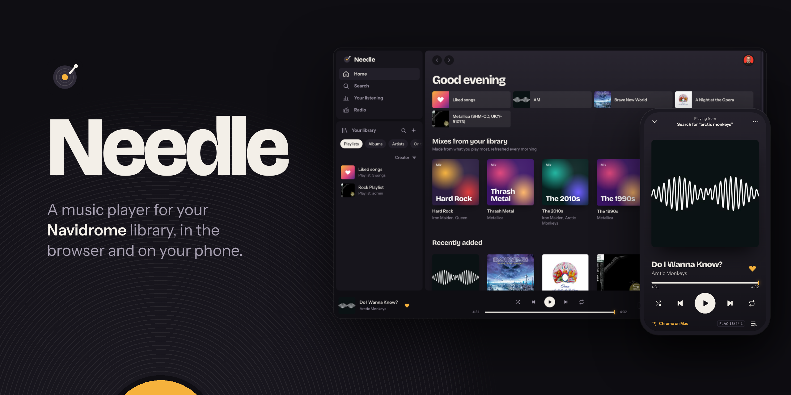
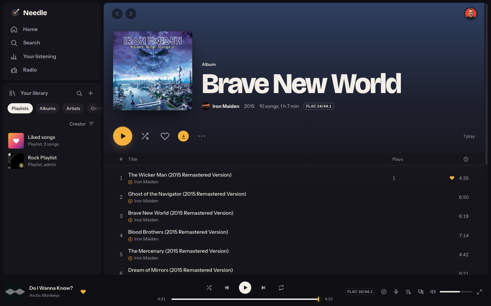
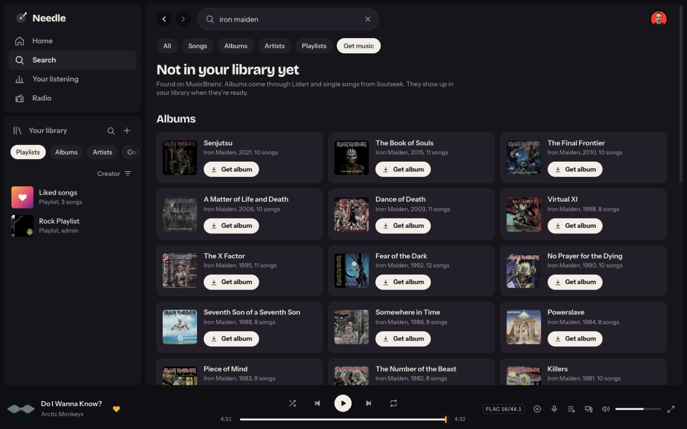
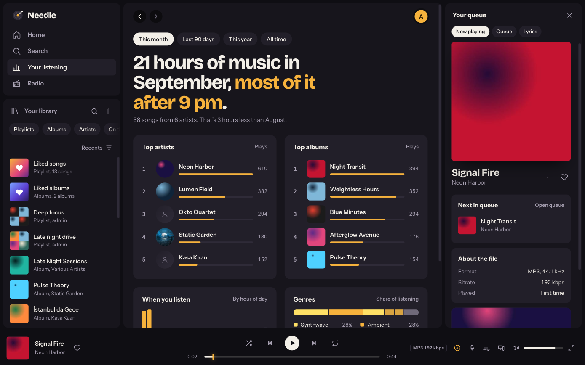
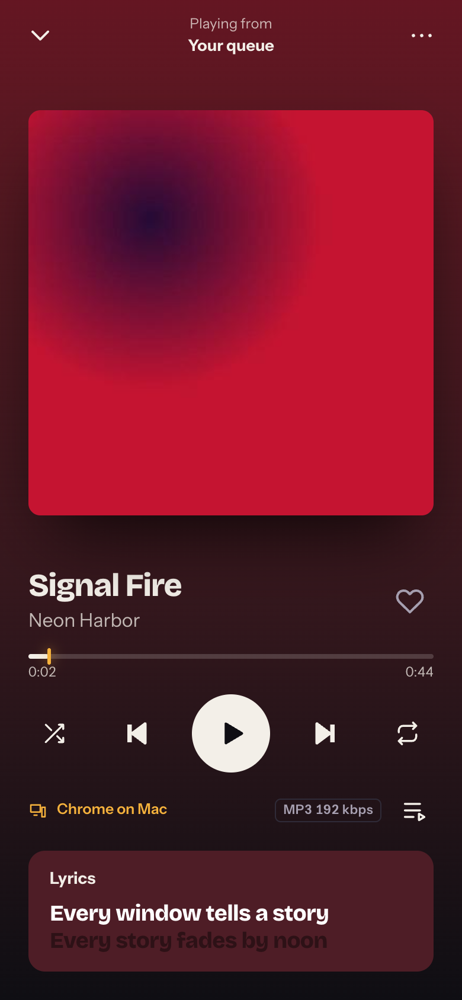
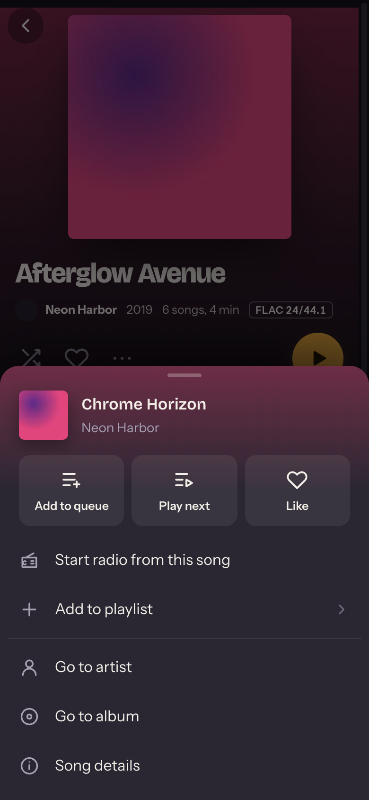
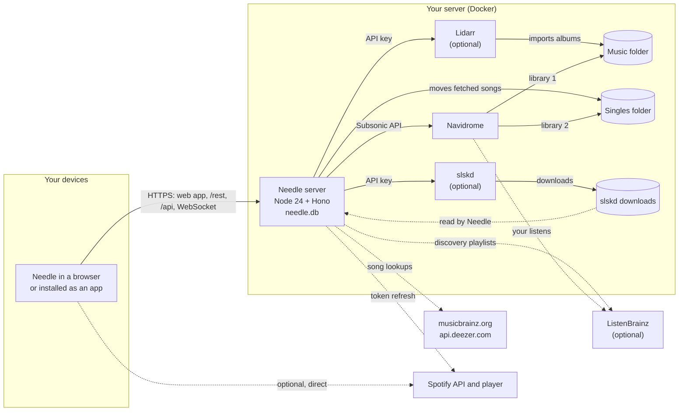
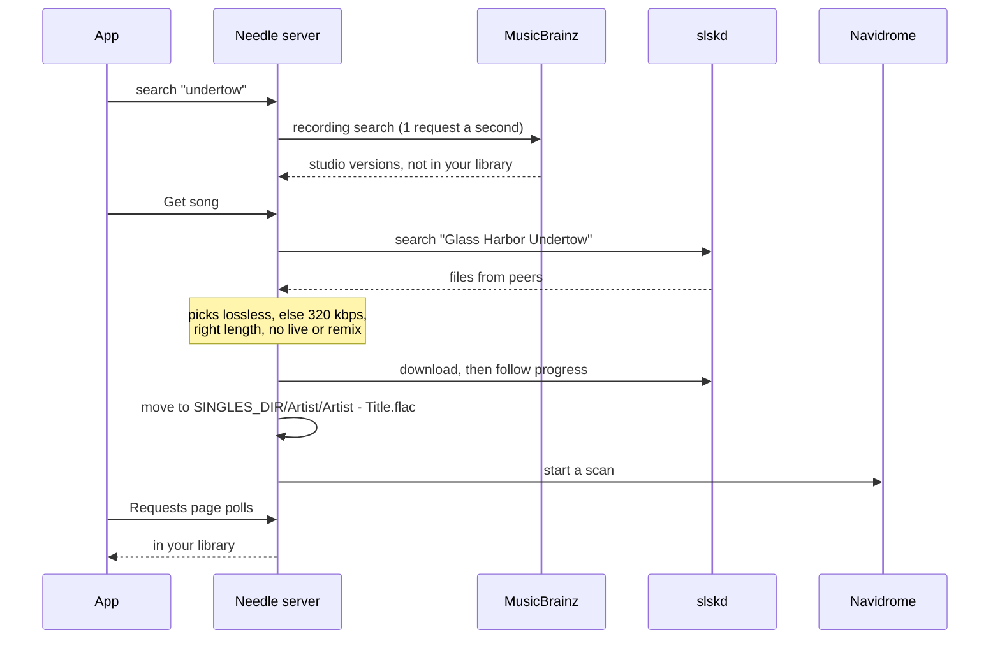

<p align="center">
  
</p>

<p align="center">
  <a href="https://github.com/bugrauluyurt/needle/actions/workflows/ci.yml"></a>
  <a href="https://github.com/bugrauluyurt/needle/releases/latest"></a>
  <a href="https://scorecard.dev/viewer/?uri=github.com/bugrauluyurt/needle"></a>
  <a href="LICENSE"></a>
</p>

# Needle

A music player for your [Navidrome](https://www.navidrome.org) library. It runs in
any browser, installs on a phone's home screen, and can fetch the albums and songs
you don't have yet through Lidarr and Soulseek. Everything runs on your own server.

<table>
  <tr>
    <td width="50%"></td>
    <td width="50%"></td>
  </tr>
  <tr>
    <td width="50%"></td>
    <td width="50%">
      
      
    </td>
  </tr>
</table>

## Contents

- [What it does](#what-it-does)
- [How it fits together](#how-it-fits-together)
- [Quick start](#quick-start)
- [HTTPS](#https)
- [Fetching albums with Lidarr](#fetching-albums-with-lidarr)
- [Fetching single songs with slskd](#fetching-single-songs-with-slskd)
- [Spotify](#spotify)
- [YouTube Music](#youtube-music)
- [ListenBrainz discovery](#listenbrainz-discovery)
- [Users and permissions](#users-and-permissions)
- [Configuration reference](#configuration-reference)
- [Data, backups and updates](#data-backups-and-updates)
- [Security](#security)
- [Troubleshooting](#troubleshooting)
- [Development](#development)
- [License and credits](#license-and-credits)

## What it does

- **Listen:** albums, artists, playlists, liked songs, genres, decades, and six mixes
  built each morning from your library. A queue with "play next", shuffle that keeps
  what you queued, repeat one or all, and similar songs when the queue ends.
- **Sound:** crossfade (desktop browsers), gapless playback, volume levelled from
  ReplayGain, and original files or Opus/AAC on mobile data.
- **Lyrics** that follow the song and seek when you tap a line.
- **Your listening:** hours, top artists and albums, genres and time of day, for any
  period, from Needle's own play log.
- **Search** matches text anywhere in titles, artists and albums, with list and grid
  views. **Show all** opens a full result list. Sort library songs and albums by release
  date or plays; Spotify results keep their relevance order and load more on demand.
- **Find within a collection:** search albums, playlists, artist songs, releases,
  downloads and the queue without changing their saved order.
- **Your library** lists every album, artist, playlist and song you have, filtered by
  All / Songs / Albums / Artists / Playlists and searchable like Search. With Spotify on,
  its sort menu also shows only your music, only Spotify, or both.
- **Fetch music** (optional): search also lists albums and songs you don't have.
  **Get album** asks Lidarr; **Get song** fetches one song from Soulseek through slskd.
  The Requests page follows both until they're in your library, and lets admins remove
  a download Lidarr couldn't import or have it **find another copy**.
- **Devices:** every open Needle signed in as you is listed. Pause or skip on another
  device, send your queue there, or pick up at the same second somewhere else.
- **Offline:** download albums, playlists or liked songs to the device. They're kept
  in the browser on that device.
- **Spotify** (optional): your Spotify library, search and playback next to your own
  music, with an on/off switch per account.
- **YouTube Music** (optional, experimental): liked songs, saved albums, followed
  artists, playlists, search and playback beside your other music. Each person
  connects their own account and can switch it off without disconnecting.
- **ListenBrainz discovery** (optional, per person): the weekly playlists ListenBrainz
  makes from what you play, on Home. Play what you have, get the rest from Soulseek,
  save them as playlists.
- **On phones:** installs to the home screen, a mini player and full-screen player,
  song options as a sheet from the bottom, and a header that turns to glass and shows
  the page's title as you scroll.
- **Languages:** English is the default, and Turkish can be selected manually in
  Settings. The choice stays on that device and updates the page language and localized
  install manifest.
- **People:** everyone with a Navidrome account signs in with their own likes,
  playlists, stats and mixes; admins choose who may request music or use Spotify.
- Internet radio, keyboard shortcuts (`?` lists them), lock-screen controls, an
  account photo, and a Connections page that checks your setup.

Needle has no accounts of its own: you sign in with your Navidrome account.

## How it fits together



- The browser talks only to the Needle server (plus Spotify, when it's on). `/rest/*`
  is Navidrome's Subsonic API passed through, so Navidrome never needs its own
  public address. `/api/*` is Needle's own API, signed with the same Navidrome token.
  `/api/devices` is a Hono WebSocket endpoint for the device list and remote controls.
- Lidarr's and slskd's API keys and Spotify's client secret stay on the server.
- `needle.db` (SQLite) keeps play history, requests, account photos, permissions,
  Spotify and YouTube Music connections, and ListenBrainz tokens. Your music,
  playlists and likes stay in Navidrome.

Fetching a single song, end to end:



[docs/architecture.md](docs/architecture.md) goes deeper: the code layout, caching,
search, Spotify's rate limits and offline downloads.

## Quick start

You need Docker with Compose, and a folder of music. Needle's image,
`ghcr.io/bugrauluyurt/needle`, runs on x86-64 (amd64) and ARM64 (Raspberry Pi 4/5,
Apple silicon).

```bash
git clone https://github.com/bugrauluyurt/needle.git
cd needle/examples
cp .env.example .env            # set MUSIC_DIR, PUID/PGID (id -u, id -g) and TZ
mkdir -p config/navidrome config/needle
docker compose up -d
```

This starts Navidrome on port 4533 and Needle on port 4535
([examples/compose.yml](examples/compose.yml)).

1. Open `http://<server>:4533` and create Navidrome's first user. It becomes an admin.
2. Open `http://<server>:4535` and sign in with that user.

Plain HTTP works for trying it out on your own network. Offline downloads, Spotify
and installing the app need HTTPS; see the next section.

Already running Navidrome? Add only the `needle` service to your compose file and
point `NAVIDROME_URL` at Navidrome as the Needle container reaches it (for example
`http://navidrome:4533` on the same Docker network).

The compose file uses `ghcr.io/bugrauluyurt/needle:1`, which follows every 1.x
release; none of them needs a change to your setup. To update only when you choose,
pin a version such as `:1.4.0`.

To build from source instead, replace the `needle` service's `image:` line with
`build: ..` (this clone) or `build: https://github.com/bugrauluyurt/needle.git#vX.Y.Z`
(no clone needed), and run `docker compose up -d --build`.

## HTTPS

Browsers only allow service workers (offline downloads, installing the app) and
Spotify's sign-in on secure pages. Put Needle behind something that gives it an
`https://` address, then set `PUBLIC_URL` to that address. Any reverse proxy works as
long as it passes WebSockets through (Needle's device list uses `/api/devices`).

### Tailscale Serve (private, no domain needed)

If your devices are on a [Tailscale](https://tailscale.com) tailnet, Tailscale
issues a real certificate for the server's `*.ts.net` name and nothing is exposed
to the internet. Turn on HTTPS certificates in the Tailscale admin console (DNS
page), then on the server:

```bash
sudo tailscale serve --bg --https=443 http://127.0.0.1:4535
```

Needle is then at `https://<machine>.<tailnet>.ts.net`, and
`PUBLIC_URL=https://<machine>.<tailnet>.ts.net`. Use another port, such as
`--https=4535`, to keep 443 free for something else; the address then ends in `:4535`.
`tailscale serve status` shows what's served, and the setting survives restarts.

### Caddy (a domain you own)

[Caddy](https://caddyserver.com) gets and renews a Let's Encrypt certificate by
itself. Point your domain's DNS at the server, open ports 80 and 443, set
`NEEDLE_DOMAIN` and `PUBLIC_URL` in `.env`, and add Caddy to the stack:

```bash
docker compose -f compose.yml -f compose.caddy.yml up -d
```

[examples/Caddyfile](examples/Caddyfile) is all it needs; Caddy passes WebSockets
through on its own. With a domain that only resolves inside your network, use
Caddy's DNS challenge instead (see Caddy's docs), because Let's Encrypt can't reach
the server to check it.

### Other proxies

nginx, Traefik and the rest work the same way: proxy everything to `needle:4535` and
allow the WebSocket upgrade on `/api/devices`. For nginx that means
`proxy_http_version 1.1`, `proxy_set_header Upgrade $http_upgrade` and
`proxy_set_header Connection "upgrade"`.

## Fetching albums with Lidarr

[Lidarr](https://lidarr.audio) fetches whole albums and imports them into your music
folder. Needle only asks it for albums; set Lidarr up with at least one indexer or
download client first (the
[Tubifarry](https://github.com/TypNull/Tubifarry) plugin lets Lidarr use slskd).

1. Run Lidarr with the same music folder Navidrome reads, mounted read-write.
   [examples/compose.fetching.yml](examples/compose.fetching.yml) has a working
   service.
2. In Lidarr, add that folder as a root folder (Settings → Media Management).
3. Copy Lidarr's API key (Settings → General) into `LIDARR_API_KEY`, and set
   `LIDARR_URL` (`http://lidarr:8686` on the same Docker network).
4. Optional: `LIDARR_QUALITY_PROFILE` (a profile's name) and `LIDARR_ROOT_FOLDER`
   (a root folder's path). Without them Needle uses the root folder's defaults.

In Needle, search for an album you don't have and tap **Get album**. Needle adds the
artist to Lidarr unmonitored and monitors only that album, so Lidarr doesn't start
downloading the artist's whole discography. The Requests page shows Lidarr's queue.

## Fetching single songs with slskd

Lidarr only fetches whole albums. For single songs Needle uses
[slskd](https://github.com/slskd/slskd), a Soulseek client, and keeps the songs in a
separate folder that Navidrome reads as a second library:

```
 slskd downloads ──► $SOULSEEK_DIR/downloads/<folder>/<file>
                          │  Needle reads it (mounted at /soulseek)
                          ▼
 Needle moves it ──► $SINGLES_DIR/<Artist>/<Artist> - <Title>.<ext>   (mounted at /singles)
                          │  Navidrome's second library, read-only
                          ▼
 Navidrome scan ──► the song is in your library
```

1. Run slskd with a Soulseek account (`SOULSEEK_USER`, `SOULSEEK_PASS`) and an API
   key (`SLSKD_API_KEY`, any long random string such as `openssl rand -hex 32`).
2. Mount slskd's downloads folder into Needle at `/soulseek` (read-write, because
   Needle moves files out of it), and a new, empty folder at `/singles`. Keep it
   separate from Lidarr's music folder so Lidarr never touches these songs.
3. Mount the same singles folder into Navidrome, read-only, at `/singles`.
4. In Navidrome (0.58 or later), add a library: **Settings → Libraries → New**,
   path `/singles`. Then give your users access to it: **Settings → Users**, open each
   user, tick the library. Admins see every library.
5. Set `SLSKD_URL` (`http://slskd:5030`) and `SLSKD_API_KEY` for Needle.

```bash
mkdir -p config/lidarr config/slskd "$SINGLES_DIR" "$SOULSEEK_DIR"/{downloads,incomplete}
docker compose -f compose.yml -f compose.fetching.yml up -d
```

Needle picks the best copy it finds: lossless first, otherwise 320 kbps or better,
the right length, and no live, remix or cover versions. If a peer fails it tries the
next one, up to three. MusicBrainz is asked at most once a second, as it requires.

**File ownership:** the Needle image runs as uid 1000. If your media belongs to
another user, set `user: "<uid>:<gid>"` on the `needle` service (the examples use
`PUID` and `PGID`) so it can move files into the singles folder.

## Spotify

Optional. It adds your Spotify library, search and playback beside your own music.
The server never downloads anything from Spotify.

1. Create an app in the [Spotify developer dashboard](https://developer.spotify.com/dashboard)
   with the **Web API** and **Web Playback SDK**.
2. Add the redirect URI `<PUBLIC_URL>/api/spotify/callback`. It must be `https://`.
   Settings → Connections shows the exact value.
3. Under **User Management**, add the Spotify account of everyone who'll connect.
   Apps in development mode only work for listed users, and Spotify limits them.
4. Set `SPOTIFY_CLIENT_ID`, `SPOTIFY_CLIENT_SECRET` and `PUBLIC_URL`, restart
   Needle, then choose **Settings → Connect Spotify** in Needle.

Spotify rate-limits development-mode apps. When it refuses (`429`), Needle stops
calling it for as long as Spotify asks and hides Spotify meanwhile. Each device
caches your Spotify library for six hours. **Settings → Use Spotify in Needle**
turns it off for your account on every device.

## YouTube Music

Optional and experimental. Needle uses [ytmusicapi](https://github.com/sigma67/ytmusicapi)
for your music library and [yt-dlp](https://github.com/yt-dlp/yt-dlp) to resolve audio
for playback. Both use unofficial YouTube interfaces, which can change or stop
working without notice. YouTube's terms restrict automated access and audio
extraction; consider those terms before enabling this integration.

1. Create your own project in [Google Cloud Console](https://console.cloud.google.com/)
   and enable the YouTube Data API v3.
2. Configure the OAuth consent screen and create an OAuth client of type **TVs and
   Limited Input devices**. Add the Google accounts that will connect as test users
   when the project is in Testing.
3. Set `YTMUSIC_CLIENT_ID` and `YTMUSIC_CLIENT_SECRET` on the Needle container and
   restart it. The published image already includes the Python bridge and playback
   resolver.
4. Open **Settings → YouTube Music → Connect**, open Google's device page, enter
   the code and grant access. Keep Needle open while it waits for Google.

Google projects left in Testing issue authorizations that expire after seven days.
Needle shows when you need to reconnect. A personal project set to In Production
can still show Google's unverified-app warning and user limits; Needle does not
provide a shared Google developer account or bypass Google's restrictions.

**Use YouTube Music in Needle** switches it off for your account on every device.
When off, Needle stops YouTube Music requests and playback. Your connection stays
saved. Disconnect removes the account credentials and cached library data from
Needle. Admins control who can connect under **Settings → People**.

Songs, albums, artists and playlists appear in Home, Search and Your library with
their own source marks. You can like songs, save albums and follow artists. YouTube
Music playlists are read-only in Needle. You can copy a playlist into Navidrome
using songs you already have, with the same matching flow as Spotify imports.

YouTube Music audio is streamed through Needle without being stored. It cannot be
downloaded for offline listening. Playback resolves public music without passing
your Google account credentials to yt-dlp, so some account-only or region-restricted
tracks may not play here. Use **Open in YouTube Music** for those tracks. A failed
resolver stops on the selected song instead of repeatedly resolving the rest of
the queue. Your own music and Spotify remain available when YouTube Music fails.

Running from source, sync the bridge with uv and set its Python executable before
starting Needle:

```bash
uv sync --project bridges/youtube-music --locked
YTMUSIC_PYTHON="$PWD/bridges/youtube-music/.venv/bin/python" pnpm dev
```

Python 3.10 through 3.14 and Node 24 are supported. Needle locks ytmusicapi, yt-dlp
and its challenge scripts. Upgrade them through a tested Needle release when
YouTube changes. Settings → Connections distinguishes account access from the
local playback resolver.

## ListenBrainz discovery

[ListenBrainz](https://listenbrainz.org) makes playlists from what you listen to:
**Weekly Exploration** (songs you haven't heard), **Weekly Jams** and **Daily Jams**
(songs you like, and more like them). Needle shows them on Home under **Made for you
by ListenBrainz**. Each person connects their own account; nothing needs setting up
on the server.

1. Create a ListenBrainz account and copy your user token from
   [listenbrainz.org/settings](https://listenbrainz.org/settings/).
2. In Needle, open **Settings → ListenBrainz**, paste the token and choose **Connect
   ListenBrainz**.
3. ListenBrainz needs your listens to pick songs. Navidrome sends them once it has
   the token. Either type your Navidrome password in the optional field when you
   connect, and Needle sets it up in Navidrome for you, or paste the same token in
   Navidrome under **Settings → Personal → ListenBrainz**.

ListenBrainz builds the first playlists after about a week of listens. A playlist
page plays the songs already in your library, and anyone who may request music can
choose **Get N missing** (up to 50 songs at a time, through slskd, into the singles
folder like any other song) or **Get song** on one of them. **Save as playlist** writes
the songs you have to a Navidrome playlist.

**Privacy:** Needle keeps your ListenBrainz token in `needle.db` to read your
playlists. Your Navidrome password is sent once to Navidrome's own sign-in to link
the token, then dropped: it is never stored, logged or sent anywhere else. Needle
never sends listens itself, so nothing is counted twice; disconnecting in Needle
doesn't stop Navidrome sending them (remove the token in Navidrome for that).

## Users and permissions

Every Navidrome user can sign in.

| Separate for each user                                                                                  | Shared by everyone                                                  |
| ------------------------------------------------------------------------------------------------------- | ------------------------------------------------------------------- |
| Liked songs, albums and artists; ratings                                                                | The music itself (users can be limited to some Navidrome libraries) |
| Playlists (private unless made public)                                                                  | Internet radio stations                                             |
| Play counts, Your listening, daily mixes                                                                |                                                                     |
| The queue, and picking up on another device                                                             |                                                                     |
| Spotify and YouTube Music connections and their on/off switches; ListenBrainz connection; account photo |                                                                     |

Add users in Navidrome (**Settings → Users**); keep them non-admin. What each person
may do beyond listening is set in Needle, under **Settings → People** (admins only):

|                                                              | Admins                 | Everyone else              |
| ------------------------------------------------------------ | ---------------------- | -------------------------- |
| **Request music** (Get album, Get song)                      | Always                 | When switched on in People |
| **Spotify**                                                  | On unless switched off | When switched on in People |
| **YouTube Music**                                            | On unless switched off | When switched on in People |
| Lidarr's download queue, Connections, People, radio stations | Yes                    | No                         |

Requests go straight to Lidarr or slskd. Admins see everyone's requests on the Requests
page and can remove any of them. Spotify's development mode only works for Spotify
accounts listed under User Management in its dashboard, and everyone shares one
Spotify allowance.

## Configuration reference

All settings are environment variables on the `needle` container. Empty values count
as unset.

| Variable                                     | Default                                               |                                                              |
| -------------------------------------------- | ----------------------------------------------------- | ------------------------------------------------------------ |
| `NAVIDROME_URL`                              | `http://127.0.0.1:4533`                               | Navidrome as the Needle server reaches it                    |
| `PUBLIC_URL`                                 |                                                       | The `https://` address people open. Needed for Spotify       |
| `PORT`                                       | `4535`                                                | Port the server listens on                                   |
| `DATA_DIR`                                   | `/data` in the image                                  | Where `needle.db` lives                                      |
| `TZ`                                         | `UTC`                                                 | Time zone for daily mixes and listening stats                |
| `LIDARR_URL`, `LIDARR_API_KEY`               |                                                       | Turns on Get album                                           |
| `LIDARR_QUALITY_PROFILE`                     | root folder's default                                 | Quality profile name for new albums                          |
| `LIDARR_ROOT_FOLDER`                         | Lidarr's first root folder                            | Root folder path for new albums                              |
| `SLSKD_URL`, `SLSKD_API_KEY`                 |                                                       | Turns on Get song                                            |
| `SOULSEEK_DIR`                               | `/soulseek`                                           | slskd's downloads folder inside the Needle container         |
| `SINGLES_DIR`                                | `/singles`                                            | Where fetched songs go; a Navidrome library                  |
| `SPOTIFY_CLIENT_ID`, `SPOTIFY_CLIENT_SECRET` |                                                       | Turns on Spotify (with `PUBLIC_URL`)                         |
| `YTMUSIC_CLIENT_ID`, `YTMUSIC_CLIENT_SECRET` |                                                       | Turns on the experimental YouTube Music connection           |
| `YTMUSIC_PYTHON`                             | bundled Python in Docker, `python3` from source       | Python executable with the pinned YouTube Music dependencies |
| `YTMUSIC_BRIDGE_PATH`                        | bundled path in Docker, repository bridge from source | Python bridge script path                                    |
| `MUSICBRAINZ_URL`                            | `https://musicbrainz.org/ws/2`                        | Song lookups; the tests point it at a mock                   |
| `DEEZER_URL`                                 | `https://api.deezer.com`                              | Popular songs for an artist                                  |
| `LISTENBRAINZ_URL`                           | `https://api.listenbrainz.org`                        | ListenBrainz playlists; the tests point it at a mock         |

**Transcoding:** Navidrome converts songs for the Opus/AAC quality settings. Its
Docker image includes ffmpeg and ready-made Opus and AAC transcodings, so there's
nothing to set up. Choose qualities in Needle's Settings.

## Data, backups and updates

- Back up `DATA_DIR` along with Navidrome's data folder. `needle.db` holds plays,
  requests, photos, permissions and connected account credentials. Your music,
  playlists and likes live in Navidrome.
- Needle applies ordered SQLite migrations in one transaction and verifies the
  expected tables, columns and indexes before it starts.
- The first upgrade of a populated database from before versioned migrations creates
  `DATA_DIR/needle.pre-migrations.db` after checking its integrity. This is a one-time
  safety copy, not a rolling backup.
- Offline downloads live in each browser and are never on the server.
- **Releases** are tagged `vX.Y.Z` and described in [CHANGELOG.md](CHANGELOG.md) and on
  the [Releases](https://github.com/bugrauluyurt/needle/releases) page. A major version
  means your setup needs a change; the changelog says what. Each release publishes
  images tagged `X.Y.Z`, `X.Y`, `X` and `latest`, with build provenance you can check:
  `gh attestation verify oci://ghcr.io/bugrauluyurt/needle:1 --owner bugrauluyurt`.
  Since v1.5.0 the release also carries its source archive, `needle-X.Y.Z.tar.gz`, and the
  archive's signed provenance: download both with `gh release download vX.Y.Z -R bugrauluyurt/needle`,
  then run `gh attestation verify needle-X.Y.Z.tar.gz --bundle needle-X.Y.Z.tar.gz.intoto.jsonl -R bugrauluyurt/needle`.
- **To update**: `docker compose pull needle && docker compose up -d needle` (change
  the tag first if you pinned a version). Building from source, point `build:` at the
  new tag, or in a clone run `git fetch --tags && git checkout vX.Y.Z`, then
  `docker compose up -d --build needle`.
- Open apps show **Update Needle** in the account menu; the new version loads when
  you choose it, so music isn't cut off.
  Settings → This app shows which version you're running.

## Security

- Needle checks every request against Navidrome, so it's only as open as your
  Navidrome accounts. Use strong passwords.
- Don't expose Needle to the internet without HTTPS. A private network such as
  Tailscale is the simplest safe setup.
- API keys and the Spotify client secret never reach the browser.
- YouTube Music client secrets and account tokens stay on the server. Needle never
  asks for copied Google browser cookies and never passes account tokens to the
  playback resolver. Protect and back up `DATA_DIR`, which holds connected-account
  credentials.
- Needle's server fetches from Navidrome, Lidarr, slskd, MusicBrainz, Deezer,
  ListenBrainz, Spotify, Google and YouTube when configured, and the internet radio
  stations you add.
- A Navidrome password typed in Settings → ListenBrainz is used once to link the token
  in Navidrome and never stored or logged.

## Troubleshooting

Open **Settings → Connections** as an admin first. It checks each part and says how
to fix what's wrong:

| Check                | Looks at                                                                |
| -------------------- | ----------------------------------------------------------------------- |
| Secure address       | Whether this page is on HTTPS                                           |
| Public address       | Whether `PUBLIC_URL` matches the address you opened                     |
| Navidrome            | Reachable, its version and libraries                                    |
| Lidarr               | Reachable, its root folder and quality profile                          |
| slskd                | Reachable and signed in to Soulseek                                     |
| Song folders         | slskd's downloads readable, the singles folder writable                 |
| Singles in Navidrome | Navidrome lists the songs Needle fetched                                |
| Song lookups         | MusicBrainz and Deezer answer                                           |
| ListenBrainz         | Your connection, and whether Navidrome sent a listen in the last 7 days |
| Spotify              | Keys set, and the redirect URI to register                              |
| YouTube Music        | The configured client and pinned metadata runtime                       |
| YouTube playback     | The Python bridge, pinned resolver and Node challenge solver            |

Common problems:

- **Sign-in says it can't reach Navidrome:** `NAVIDROME_URL` is the address from
  inside the Needle container. `localhost` there is the container itself; use the
  service name on a shared Docker network.
- **Fetched songs never appear:** the singles library is missing in Navidrome, or
  your user can't see it (step 4 of [slskd](#fetching-single-songs-with-slskd)).
- **Get song fails at "moving":** Needle can't write to `SINGLES_DIR` or delete from
  slskd's downloads. Check file ownership and the `user:` setting.
- **No Download button, or the app won't install:** the page isn't on HTTPS.
- **Spotify sign-in fails:** the redirect URI in Spotify's dashboard must match
  `<PUBLIC_URL>/api/spotify/callback` exactly, and your Spotify account must be listed
  under User Management.
- **Spotify disappears for a while:** Spotify rate-limited the app (`429`); Needle waits
  as long as Spotify asks and brings it back. Every user shares one allowance.
- **Someone is missing from Settings → People:** Navidrome won't list other users to
  Needle, so People shows everyone who has opened Needle, plus anyone you've set up in
  advance (PUT `/api/people/<name>`, which arr-stack-style scripts can call).
- **An album stays at "Album match is not close enough":** Lidarr downloaded a copy
  that doesn't match the album (another edition, a bootleg, missing tracks). On the
  Requests page choose **Find another copy**, or × to drop it.
- **Lidarr finds copies but takes none:** its search log says why; "X is not wanted in
  profile" means the artist's quality profile excludes that format (a lossy-only
  profile rejects FLAC). Set `LIDARR_QUALITY_PROFILE` for new albums, or change the
  artist's profile in Lidarr.
- **Get album never finds rare music through Soulseek:** if Lidarr uses slskd through
  the Tubifarry plugin, that indexer's **automatic search** must be on (Lidarr leaves it
  off for indexers without RSS), and a longer search timeout helps.
- **Made for you by ListenBrainz stays empty:** ListenBrainz builds the playlists from
  your listens, weekly. Check Settings → Connections: if Navidrome hasn't sent a listen
  in 7 days, paste your token in Navidrome (Settings → Personal → ListenBrainz).
- **Connecting ListenBrainz says Navidrome is limiting sign-ins:** Navidrome allows a
  few sign-ins a minute; wait a minute and connect again.
- `docker logs needle` shows the server's errors.

## Development

Needle is a pnpm monorepo: `apps/web` contains React 19 and Vite, `apps/server`
contains Node 24 and Hono, `packages/shared` contains shared contracts and runtime
schemas, and `bridges/youtube-music` is an isolated uv project for the Python
integration.

Source development requires Node 24, pnpm, Docker, uv and Python 3.10 through 3.14.

```bash
pnpm install
uv sync --project bridges/youtube-music --locked
pnpm fixtures              # generates e2e/.library: 38 tagged songs with covers and lyrics
pnpm navidrome:test        # a throwaway Navidrome on 127.0.0.1:14533 (admin / needle-test)
NEEDLE_DATA_DIR=./data pnpm seed   # playlists, likes, radio stations, 75 days of plays
cp .env.example .env
pnpm dev                   # server on :14535 and Vite on :5173
```

```bash
pnpm format:check
pnpm lint
pnpm typecheck
pnpm test
pnpm build
pnpm e2e
```

`pnpm lint` checks TypeScript with ESLint and Python with Ruff. `pnpm test` runs
Vitest and the Python bridge tests. `pnpm e2e` starts a test Navidrome, external
integration mocks and a Needle server on the production build. Contributor conventions
are in [AGENTS.md](AGENTS.md).

## License and credits

[MIT](LICENSE). Needle builds on [Navidrome](https://www.navidrome.org) and talks to
[Lidarr](https://lidarr.audio), [slskd](https://github.com/slskd/slskd),
[MusicBrainz](https://musicbrainz.org), [Deezer](https://developers.deezer.com) and
[Spotify](https://developer.spotify.com). Artist biographies come from Last.fm
through Navidrome. The bundled fonts, Bricolage Grotesque and Instrument Sans, are
under the [SIL Open Font License](apps/web/public/fonts/OFL.txt).

Experimental YouTube Music support uses [ytmusicapi](https://github.com/sigma67/ytmusicapi)
(MIT) and [yt-dlp](https://github.com/yt-dlp/yt-dlp) (Unlicense), with their dependencies.
